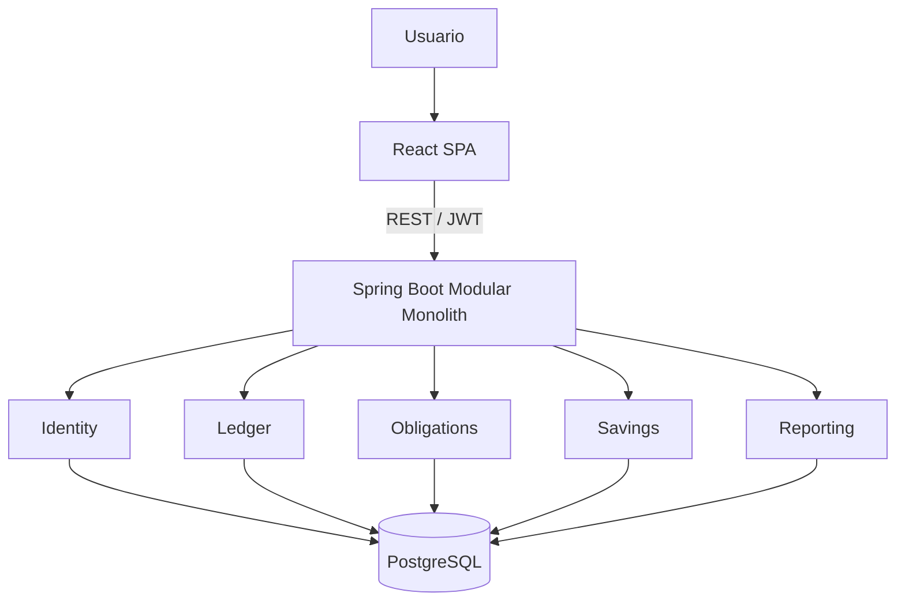

# Roadmap de Desarrollo

## Estado verificado al 2026-04-15

Este roadmap fue contrastado contra el código real del repositorio.

### Estado actual

- **Fase 0: COMPLETADA**
- **Fase 1: COMPLETADA**
- **Fase 2+: pendientes**

### Evidencia ya implementada en el repositorio

- backend Spring Boot 4 + Java 21 sobre `com.gestorgastos`
- perfiles de configuración
- Flyway
- seguridad con JWT + refresh token persistido
- manejo global de errores
- observabilidad base con Actuator y trace id
- módulos `identity`, `ledger`, `shared` y ahora `reporting`
- cuentas, categorías, movimientos, transferencias, balance por período y dashboard básico
- frontend SPA base en React + TypeScript + Vite con features de auth, dashboard, cuentas, categorías y movimientos
- Docker Compose con PostgreSQL, backend y frontend

## Resumen ejecutivo
La recomendación correcta para este proyecto es un monolito modular con API REST, construido sobre el backend actual en Java 21 + Spring Boot + PostgreSQL, con React SPA en frontend y Docker Compose para desarrollo/local.

La clave NO es meter tecnología; la clave es modelar BIEN el dominio desde el inicio.
Debes separar claramente:

identidad y acceso;
cuentas y movimientos;
categorías;
obligaciones financieras;
activos a cobrar;
ahorro/inversión;
reporting.
Mi postura es esta:

Monolito modular, no microservicios.
Modular + hexagonal pragmática, no capas globales rígidas.
JWT de acceso corto + refresh token rotado, pensando en SPA hoy y mobile mañana.
Cálculos derivados por consulta, no totales persistidos como “verdad”.
Mobile en una fase posterior, cuando el API y el modelo ya estén estabilizados.
Eso te da una base SIMPLE, mantenible y con crecimiento controlado.

2. Arquitectura recomendada alineada al repositorio actual
Hoy el repositorio YA no está en estado de scaffold puro. La base técnica y el MVP financiero inicial ya existen; a partir de aquí el foco correcto es proteger la calidad del núcleo y avanzar sobre obligaciones, ahorro y analítica sin romper `ledger`.

Evolución recomendada desde el scaffold actual
Fase 0: convertir el scaffold en una base de producto

renombrar el package base de com.example.demo a un namespace real;
agregar configuración por perfiles;
agregar migraciones de base de datos;
agregar seguridad base;
agregar manejo global de errores;
agregar observabilidad mínima;
definir convenciones modulares.
Construir el backend como monolito modular

no un árbol global tipo controller/service/repository para todo el proyecto;
sí módulos por dominio, y dentro de cada módulo:
api
application
domain
infrastructure
Separar el dominio en bounded contexts pragmáticos

identity
ledger
obligations
savings
reporting
shared
Construir el frontend como SPA por features

auth
dashboard
accounts
transactions
categories
obligations
reports
settings
Mantener una sola base de datos PostgreSQL

una sola app;
una sola base;
límites lógicos por módulo;
nada de particionar infraestructura antes de tiempo.
Decisión arquitectónica principal
Backend recomendado: monolito modular con puertos y adaptadores pragmáticos.

¿Por qué?

Resuelve la complejidad real del dominio sin meter complejidad operacional innecesaria.
Te permite crecer módulo a módulo.
Mantiene bajo el costo de despliegue, debugging y testing.
Con ~20 usuarios iniciales, microservicios serían ARQUITECTÓNICAMENTE incorrectos.
3. Justificación del stack y tradeoffs
Backend
Decisión: Spring Boot 4.0.5 sobre Java 21, manteniendo el stack actual.

Por qué es buena

Ya está en el repo.
Tiene soporte maduro para web, seguridad, validación y persistencia.
Reduce riesgo de integración.
Qué problema resuelve

Permite construir rápido sobre fundaciones conocidas.
Evita rehacer el backend.
Qué costo introduce

Si no defines límites modulares, Spring tiende a convertirse en “todo depende de todo”.
Qué dejo para después

separación física de módulos;
optimizaciones de performance avanzadas;
arquitectura distribuida.
Frontend
Decisión: React SPA con TypeScript, Vite, React Router, TanStack Query, React Hook Form + Zod.

Por qué es buena

Es el stack mínimo con excelente productividad y buen control.
TanStack Query resuelve caché, sincronización y estados remotos SIN meter Redux por reflejo.
Qué problema resuelve

Mantiene clara la separación entre UI y datos remotos.
Escala mejor que React “a pelo” sin estructura.
Qué costo introduce

Agrega algunas librerías base.
Requiere disciplina de feature folders.
Qué dejo para después

SSR;
microfrontends;
state management más complejo.
Base de datos
Decisión: PostgreSQL único, esquema relacional normalizado y migrado con Flyway.

Por qué es buena

El dominio financiero es fuertemente relacional.
PostgreSQL resuelve transacciones, constraints, índices y reporting SQL de forma natural.
Qué problema resuelve

Consistencia de datos financieros.
Consultas de balance y reportes por período.
Qué costo introduce

Debes diseñar bien el modelo desde el inicio.
Migraciones mal pensadas pueden complicar evolución.
Qué dejo para después

materialización avanzada;
particionado;
réplica de lectura.
Autenticación
Decisión: access token JWT corto + refresh token rotado.

Por qué es buena

Hoy sirve para SPA.
Mañana sirve para mobile sin rediseñar todo.
Mantiene al backend como API limpia y desacoplada.
Qué problema resuelve

Evita amarrarte a sesión web tradicional.
Facilita futura evolución multi-cliente.
Qué costo introduce

Más complejidad que una cookie session simple.
Requiere rotación, revocación y manejo serio del refresh token.
Qué dejo para después

MFA;
device management;
social login.
Contenedores
Decisión: Docker Compose para local; imágenes separadas de backend, frontend y PostgreSQL.

Por qué es buena

Entorno reproducible.
Aísla dependencias.
Facilita onboarding.
Qué problema resuelve

“En mi máquina funciona”.
acoplamiento innecesario entre servicios locales.
Qué costo introduce

Necesitas Dockerfiles y variables bien definidas.
Qué dejo para después

Kubernetes;
service mesh;
escalado horizontal complejo.
Mobile
Decisión: NO ahora. Fase posterior.

Por qué es buena

Primero debes estabilizar dominio, API y seguridad.
Hacer web + mobile al mismo tiempo te dispersa.
Qué problema resuelve

Evita duplicar trabajo sobre una base aún inmadura.
Qué costo introduce

Mobile se posterga.
Qué dejo para después

app React Native o Flutter;
notificaciones push;
sincronización móvil offline.
4. Módulos principales del backend
Dominio
identity
usuario
credenciales
refresh tokens
políticas de acceso
ledger
cuentas
categorías
movimientos
transferencias entre cuentas
moneda y montos
obligations
préstamos bancarios
préstamos vehiculares
tarjetas de crédito
deudas con terceros
dinero a cobrar
savings
ahorro
metas de ahorro
posiciones de inversión simples
reporting
balances
reportes por período
métricas del dashboard
dinero disponible luego de obligaciones
shared
money
currency
errores de dominio
utilidades comunes
auditoría básica
Aplicación
Casos de uso por módulo, por ejemplo:

RegisterUser
LoginUser
CreateAccount
CreateTransaction
TransferBetweenAccounts
CreateLoan
GetDashboardSummary
GetBalanceByPeriod
Aquí vive la orquestación, transacciones y validaciones de negocio transversales.

Infraestructura
repositorios JPA
entidades persistentes
adaptadores JWT
adaptadores de password encoder
Flyway
config de seguridad
config de CORS
logging
adapters de mail
API
controladores REST
DTOs request/response
mappers
error handling
contratos /api/v1/...
Límites modulares recomendados
No hagas esto:

un TransactionService que conoce préstamos, tarjetas, reportes y usuarios.
Haz esto:

cada módulo con sus casos de uso;
reporting consulta a otros módulos mediante puertos/servicios de lectura;
shared solo contiene utilidades verdaderamente compartidas.
5. Módulos principales del frontend
Estructura por features
auth
dashboard
accounts
categories
transactions
obligations
reports
savings
settings
Vistas principales
login
registro
dashboard
cuentas
movimientos
categorías
préstamos
tarjetas
deudas / cuentas por cobrar
reportes
configuración
Manejo de estado
Decisión:

server state: TanStack Query
UI/auth state: Zustand o contexto liviano
forms: React Hook Form + Zod
No uses Redux de entrada. Eso sería SOBREDISEÑO para este tamaño.

Capa de API
cliente HTTP único
interceptores para refresh token
manejo centralizado de errores
tipado por DTOs
hooks por feature (useAccounts, useTransactions, etc.)
Decisión de librerías mínimas recomendadas
React + TypeScript
Vite
React Router
TanStack Query
React Hook Form
Zod
Recharts o ECharts para dashboard
Tailwind o CSS Modules, según preferencia del equipo
6. Modelo de dominio y datos inicial
Entidades principales
Usuario
id
full_name
email
birth_date
password_hash
status
created_at
updated_at
Cuenta
id
user_id
name
type (CASH, BANK, SAVINGS, CREDIT_LINE, etc.)
currency
opening_balance
is_archived
created_at
updated_at
Categoría
id
user_id nullable si es del sistema
name
type (INCOME, EXPENSE)
color / icon opcional
is_system
is_archived
Movimiento
id
user_id
account_id
category_id nullable para ciertos casos controlados
type (INCOME, EXPENSE, TRANSFER_IN, TRANSFER_OUT, ADJUSTMENT)
amount
currency
occurred_at
description
reference_type opcional
reference_id opcional
created_at
updated_at
Institución financiera
id
name
country opcional
is_active
Préstamo
id
user_id
institution_id
loan_type (BANK, VEHICLE)
principal_amount
currency
start_date
total_installments
current_installment
monthly_amount
outstanding_balance
status
Cuota de préstamo
id
loan_id
installment_number
due_date
amount
principal_component opcional
interest_component opcional
paid_at nullable
payment_transaction_id nullable
status
Tarjeta de crédito
id
user_id
institution_id
name
closing_day
due_day
currency
credit_limit nullable
status
Consumo en tarjeta / compra en cuotas
id
credit_card_id
transaction_date
merchant
total_amount
installments_total
current_installment
installment_amount
status
Deuda con tercero
id
user_id
creditor_name
amount
currency
due_date
status
linked_transaction_id nullable
Cuenta por cobrar
id
user_id
debtor_name
amount
currency
due_date
status
linked_transaction_id nullable
Ahorro / inversión
id
user_id
name
type (SAVINGS_GOAL, FIXED_TERM, MANUAL_INVESTMENT)
target_amount nullable
current_amount
currency
status
Relaciones
un usuario tiene muchas cuentas
un usuario tiene muchas categorías
un usuario tiene muchos movimientos
un usuario tiene muchas obligaciones
una cuenta tiene muchos movimientos
una institución financiera tiene muchos préstamos y tarjetas
un préstamo tiene muchas cuotas
una tarjeta tiene muchos consumos o compras financiadas
Reglas de negocio clave
Transferencia no es ingreso ni gasto
Son dos movimientos enlazados: salida y entrada.

Tarjeta de crédito no es categoría
Es un instrumento financiero. El gasto real puede categorizarse, pero la tarjeta es el medio o la obligación asociada.

Préstamo no es gasto
Es un pasivo. Sus cuotas sí impactan caja y pueden afectar disponibilidad.

Deuda y dinero a cobrar no son transacciones comunes
Son compromisos/activos pendientes, con ciclo propio.

Moneda siempre explícita
Nunca asumas un total global mezclando monedas.

Qué se persiste y qué se calcula
Se persiste
usuarios
cuentas
categorías
movimientos
obligaciones
cuotas
instrumentos financieros
metas/posiciones de ahorro
refresh tokens
auditoría básica
Se calcula
balance por cuenta
balance por período
total de ingresos
total de gastos
saldo neto
cuotas pagadas/restantes
dinero disponible luego de obligaciones
métricas del dashboard
Cómo preparar el modelo para crecer sin contaminar el núcleo
mantener ledger limpio y enfocado en caja/movimientos;
manejar obligations como módulo separado;
no meter herencia abstracta innecesaria desde el día 1;
permitir reference_type/reference_id en movimientos para vincular pagos a obligaciones sin acoplar toda la base.
7. Flujos principales del usuario
Registro/login
usuario se registra con email y password;
password se hashea;
se crea usuario;
login devuelve access token y refresh token;
frontend obtiene perfil actual y muestra bienvenida.
Alta de ingreso
usuario elige cuenta;
selecciona categoría de tipo INCOME;
ingresa monto, fecha, descripción;
se persiste movimiento;
balance se recalcula por consulta.
Alta de gasto
usuario elige cuenta o medio asociado;
selecciona categoría EXPENSE;
registra monto, fecha y descripción;
si es gasto financiado, puede quedar vinculado a tarjeta u obligación;
reportes reflejan el impacto según fecha y tipo.
Alta de préstamo
usuario crea préstamo con institución, monto, tipo, fecha y cuotas;
sistema genera el plan de cuotas;
cada cuota puede marcarse como pagada mediante un movimiento;
reporting muestra deuda remanente y carga mensual.
Visualización de balances
usuario entra al dashboard;
backend consulta agregados por cuenta/período;
devuelve ingresos, gastos, neto, obligaciones próximas y disponible;
si hay varias monedas, muestra por moneda o total normalizado solo si existe regla explícita.
Reportes
por período
por categoría
por cuenta
por moneda
por obligaciones próximas
por evolución mensual
8. Estrategia de autenticación y autorización
Almacenamiento de credenciales
password_hash en base de datos
nunca texto plano
refresh tokens persistidos de forma segura, idealmente hasheados
Hash de passwords
Decisión: BCrypt con factor configurable.

Por qué

simple, estándar y soportado por Spring Security.
Sesiones/tokens
Decisión:

access token JWT corto
refresh token rotado
refresh en cookie httpOnly/secure para web
revocación por tabla de refresh tokens
Duraciones sugeridas

access: 10 a 15 min
refresh: 7 a 30 días según política
Permisos
rol inicial: USER
rol futuro opcional: ADMIN
autorización centrada sobre ownership del recurso
Aislamiento de datos por usuario
ESTO ES CRÍTICO:

cada consulta debe filtrar por user_id;
nunca cargar un recurso por id y después “ver si pertenece” sin una política clara;
preferir repositorios/casos de uso del tipo:
findByIdAndUserId(...)
findAllByUserId(...)
9. Estrategia de testing
Unit tests
validadores de dominio
balance calculators
reglas de transferencias
reglas de cuotas
auth service
money calculations
Integration tests
flujo de autenticación
persistencia con PostgreSQL real vía Testcontainers
casos de uso completos críticos
Tests de repositorio
@DataJpaTest
queries por user_id
agregaciones por período
consultas de reporting
Tests de API
@WebMvcTest o integración completa
validación de requests
errores consistentes
acceso no autorizado
acceso a recurso de otro usuario
Tests frontend
unit/component con Vitest + Testing Library
tests de formularios
tests de navegación crítica
E2E con Playwright después del MVP base
Qué probar primero en MVP
login/registro
aislamiento por usuario
alta de cuenta
alta de movimiento
balance por período
transferencia entre cuentas
validaciones de categoría/tipo
Eso es FUNDACIONAL. Si eso falla, el resto se construye torcido.

10. Estrategia de despliegue
Docker Compose local
Servicios:

postgres
backend
frontend
opcional en dev: mailhog
Ambientes sugeridos
local
dev
staging
prod
Variables de entorno
Backend:

SPRING_DATASOURCE_URL
SPRING_DATASOURCE_USERNAME
SPRING_DATASOURCE_PASSWORD
APP_JWT_SECRET
APP_JWT_ACCESS_TTL
APP_JWT_REFRESH_TTL
APP_CORS_ALLOWED_ORIGINS
APP_DEFAULT_TIMEZONE
MAIL_HOST
MAIL_PORT
MAIL_USERNAME
MAIL_PASSWORD
Frontend:

VITE_API_BASE_URL
Logging
logs estructurados
request id / correlation id
errores con contexto funcional, no con ruido
Observabilidad mínima
health endpoint
readiness/liveness
métricas básicas
auditoría de errores de seguridad
Recomendación: agregar spring-boot-starter-actuator en fase 0.

11. Riesgos técnicos y mitigaciones
Riesgo: modelar mal el dominio desde el inicio
Mitigación: separar ledger, obligations y savings; no meter tarjetas/préstamos dentro de “gastos”.

Riesgo: mezclar monedas en balances falsos
Mitigación: montos con moneda explícita; balances por moneda; normalización solo con tipo de cambio explícito.

Riesgo: acoplar demasiado todo el backend
Mitigación: módulos claros y casos de uso separados.

Riesgo: seguridad incompleta en una app financiera
Mitigación: BCrypt, JWT corto, refresh rotado, filtros por user_id, pruebas de acceso.

Riesgo: reportes lentos al crecer
Mitigación: empezar con queries agregadas; materializar recién cuando exista evidencia de necesidad.

Riesgo: querer hacer web + mobile + finanzas avanzadas a la vez
Mitigación: fases estrictas y alcance controlado.

Riesgo: dejar migraciones para después
Mitigación: introducir Flyway en fase 0.

12. Roadmap por fases
Fase 0: fundaciones técnicas
Objetivo: convertir el scaffold en una base mantenible de producto.
Estado: COMPLETADA.
Funcionalidades incluidas:
estructura modular inicial;
perfiles de configuración;
Flyway;
seguridad base;
manejo global de errores;
observabilidad mínima;
Docker Compose local.
Módulos afectados:
shared
identity
infrastructure
api
Decisiones técnicas relevantes:
renombrar package base;
introducir api/application/domain/infrastructure por módulo;
agregar JWT + refresh;
agregar Actuator y Flyway.
Qué se posterga:
reporting avanzado;
obligaciones;
ahorro;
mobile.
Riesgos:
sobrediseñar antes de tener negocio;
dejar seguridad a medias.
Criterio de salida de la fase:
proyecto arranca con configuración limpia;
auth base definida;
migraciones operativas;
convenciones fijadas.
Fase 1: MVP financiero base
Objetivo: entregar la primera versión útil para finanzas personales básicas.
Estado: COMPLETADA.
Funcionalidades incluidas:
registro/login;
perfil actual y bienvenida;
cuentas;
categorías;
movimientos;
transferencias;
balance por período;
dashboard básico.
Módulos afectados:
identity
ledger
reporting
frontend auth/dashboard/accounts/transactions/categories
Decisiones técnicas relevantes:
no persistir balances agregados;
calcular balances y dashboard a partir del ledger persistido;
separar transferencias de ingresos/gastos.
Qué se posterga:
préstamos;
tarjetas;
deudas;
ahorro/inversión avanzada.
Riesgos:
contaminar ledger con conceptos de obligaciones;
no filtrar correctamente por usuario.
Criterio de salida de la fase:
un usuario puede usar la app diariamente para registrar y consultar su dinero.
Fase 2: compromisos financieros
Objetivo: incorporar obligaciones reales sin romper el núcleo.
Estado: SIGUIENTE FASE.
Funcionalidades incluidas:
préstamos bancarios;
préstamos vehiculares;
tarjetas de crédito;
deudas con terceros;
cuentas por cobrar;
cálculo de obligaciones próximas.
Módulos afectados:
obligations
reporting
frontend obligations/reports/dashboard
Decisiones técnicas relevantes:
mantener obligaciones fuera de ledger;
vincular pagos con movimientos vía referencias;
modelar cuotas explícitamente.
Qué se posterga:
importación bancaria;
automatizaciones complejas;
mobile.
Riesgos:
duplicar información entre obligaciones y movimientos;
generar inconsistencias en cuotas.
Criterio de salida de la fase:
el usuario ve claramente cuánto debe, cuánto le deben y cuánto tiene realmente disponible.
Fase 3: analítica y experiencia
Objetivo: mejorar lectura financiera y usabilidad.
Estado: PENDIENTE.
Funcionalidades incluidas:
dashboard avanzado;
comparativas mensuales;
tendencias;
ahorro/metas;
inversión manual;
UX más pulida;
reportes exportables simples.
Módulos afectados:
reporting
savings
frontend dashboard/reports/savings
Decisiones técnicas relevantes:
usar proyecciones dedicadas;
introducir snapshots solo si hay evidencia de necesidad.
Qué se posterga:
offline first;
integraciones bancarias fuertes;
mobile nativo.
Riesgos:
meter analítica pesada demasiado pronto;
persistir KPIs sin criterio.
Criterio de salida de la fase:
el producto ya no solo registra, también ayuda a decidir.
Fase 4: escalado controlado
Objetivo: endurecer operación y preparar expansión de clientes/canales.
Estado: PENDIENTE.
Funcionalidades incluidas:
hardening de seguridad;
auditoría mejorada;
importaciones;
optimizaciones de reporting;
piloto mobile si el API ya está estable.
Módulos afectados:
todos, con foco en infrastructure/reporting/identity
Decisiones técnicas relevantes:
materializaciones selectivas;
observabilidad más seria;
revisión de índices y performance;
posible API pública interna más estable.
Qué se posterga:
microservicios, salvo evidencia brutal;
eventos distribuidos.
Riesgos:
optimizar antes de tener métricas;
multiplicar clientes sin endurecer contratos.
Criterio de salida de la fase:
plataforma estable, medible y lista para ampliar canales.
13. Estructura de carpetas sugerida
Backend
GestorGastos/demo/
└── src/
    ├── main/
    │   ├── java/com/gestorgastos/
    │   │   ├── shared/
    │   │   │   ├── api/
    │   │   │   ├── domain/
    │   │   │   └── infrastructure/
    │   │   ├── identity/
    │   │   │   ├── api/
    │   │   │   ├── application/
    │   │   │   ├── domain/
    │   │   │   └── infrastructure/
    │   │   ├── ledger/
    │   │   │   ├── api/
    │   │   │   ├── application/
    │   │   │   ├── domain/
    │   │   │   └── infrastructure/
    │   │   ├── obligations/
    │   │   │   ├── api/
    │   │   │   ├── application/
    │   │   │   ├── domain/
    │   │   │   └── infrastructure/
    │   │   ├── savings/
    │   │   │   ├── api/
    │   │   │   ├── application/
    │   │   │   ├── domain/
    │   │   │   └── infrastructure/
    │   │   ├── reporting/
    │   │   │   ├── api/
    │   │   │   ├── application/
    │   │   │   ├── domain/
    │   │   │   └── infrastructure/
    │   │   └── GestorGastosApplication.java
    │   └── resources/
    │       ├── db/migration/
    │       ├── application.yml
    │       ├── application-local.yml
    │       ├── application-dev.yml
    │       └── application-prod.yml
    └── test/
        ├── java/com/gestorgastos/
        │   ├── identity/
        │   ├── ledger/
        │   ├── obligations/
        │   └── reporting/
        └── resources/
Frontend
frontend/
└── src/
    ├── app/
    │   ├── router/
    │   ├── providers/
    │   └── store/
    ├── shared/
    │   ├── components/
    │   ├── lib/
    │   ├── api/
    │   ├── types/
    │   └── utils/
    ├── features/
    │   ├── auth/
    │   ├── dashboard/
    │   ├── accounts/
    │   ├── categories/
    │   ├── transactions/
    │   ├── obligations/
    │   ├── savings/
    │   ├── reports/
    │   └── settings/
    ├── pages/
    └── main.tsx
14. Diagrama

REST / JWT
Usuario
React SPA
Spring Boot ModularMonolith
Identity
Ledger
Obligations
Savings
Reporting
PostgreSQL
15. Orden recomendado de implementación
✅ renombrar package base y limpiar scaffold;
✅ definir estructura modular backend;
✅ agregar Flyway;
✅ agregar perfiles/configuración;
✅ implementar manejo global de errores;
✅ implementar auth base;
✅ implementar usuario actual / bienvenida;
✅ implementar cuentas;
✅ implementar categorías;
✅ implementar movimientos;
✅ implementar transferencias;
✅ implementar balance y dashboard básico;
✅ montar frontend SPA base;
✅ conectar auth + cuentas + movimientos;
✅ agregar reporting básico;
agregar préstamos;
agregar tarjetas;
agregar deudas y cuentas por cobrar;
agregar ahorro/inversión;
endurecer observabilidad, performance y seguridad;
evaluar mobile solo cuando el API esté estable.
